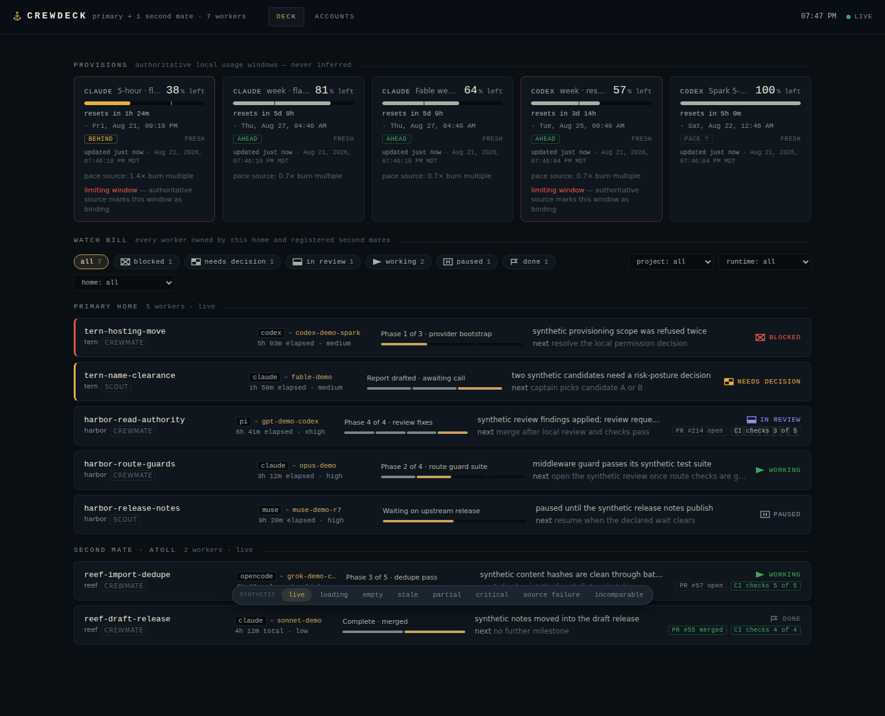
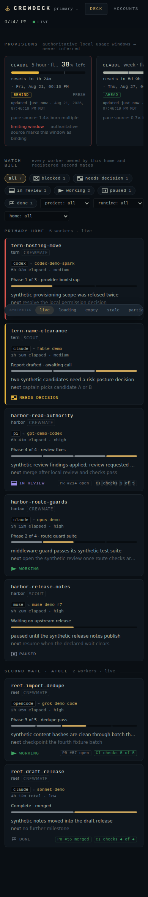

# Crewdeck

Crewdeck is a polished, local-only night-watch dashboard for workers owned by one Firstmate home and its registered second mates. It shows the watch bill, semantic worker state, runtime/model axes, elapsed time, review gates, and authoritative `quota-axi` provision windows without exposing private operational records to the browser.




## Local-only guarantee

- The custom Node server binds **exactly `127.0.0.1`** by default and refuses any other configured bind address.
- Requests require an explicit loopback IP `Host`; forwarded headers, hostname aliases, and cross-origin mutations are refused.
- CSP limits scripts, styles, fonts, images, forms, and connections to Crewdeck itself. There are no remote fonts, CDNs, analytics, telemetry, cloud APIs, public links, or sharing endpoints.
- Browser payloads are built field-by-field from the presentation contracts in [`src/server/contracts.ts`](src/server/contracts.ts). Unknown upstream fields are excluded. [`src/server/safety.ts`](src/server/safety.ts) blocks representative filesystem locations, emails, credential material, terminal/control text, and monetary data again at serialization.
- Live fleet and quota snapshots stay in process memory. There is no database or live-data cache. The only Crewdeck persistence is account registrations containing `alias` + masked `sourceId`.
- Crewdeck opens no arbitrary or provider network connection. It runs fixed local argv only: Firstmate's read-only fleet collector with `--json`, and `quota-axi --json` (never `--full`). A registered remote second mate remains Firstmate's responsibility: its trusted collector may use Firstmate's existing bounded supervision channel; Crewdeck has no SSH implementation or remote target input.

See [`docs/privacy.md`](docs/privacy.md) for the threat model and exact allowlist.

## Setup

Requirements: Node 22+, npm, and Chromium for browser tests.

```sh
npm ci
cp .env.example .env
npm run dev
# http://127.0.0.1:4317
```

`npm run dev` defaults to synthetic mode so a public checkout never probes local tools or homes. For a production build:

```sh
npm run build
CREWDECK_DEMO=1 npm start
```

For live local state, explicitly configure the owning Firstmate home:

```sh
CREWDECK_DEMO=0 FM_HOME=/absolute/firstmate/home npm run build
CREWDECK_DEMO=0 FM_HOME=/absolute/firstmate/home npm start
```

Crewdeck never scans processes, terminals, or global namespaces. If `FM_HOME` is absent in live mode, startup fails closed. The Firstmate collector's state metadata and validated second-mate registrations are the only fleet membership authority.

## Configuration

| variable                 | default                                 | contract                                                                                   |
| ------------------------ | --------------------------------------- | ------------------------------------------------------------------------------------------ |
| `CREWDECK_HOST`          | `127.0.0.1`                             | Any other value is refused.                                                                |
| `CREWDECK_PORT`          | `4317`                                  | Local port from 1024–65535.                                                                |
| `CREWDECK_DEMO`          | `1` for `npm run dev`                   | Synthetic, no-private-data fixtures and acceptance scenarios. Set `0` for live mode.       |
| `FM_HOME`                | none                                    | Required in live mode; sole primary ownership root.                                        |
| `CREWDECK_FLEET_COMMAND` | `$FM_HOME/bin/fm-fleet-snapshot.sh`     | Optional absolute path to the trusted read-only collector. Argv remains fixed to `--json`. |
| `CREWDECK_QUOTA_COMMAND` | `quota-axi` on `PATH`                   | Optional absolute executable path. Argv remains fixed to `--json`.                         |
| `CREWDECK_ACCOUNTS_FILE` | `$FM_HOME/state/crewdeck/accounts.json` | Optional absolute non-secret registration file.                                            |

## Architecture and data flow

```text
configured FM_HOME ──> fm-fleet-snapshot.sh --json ─┐
                                                     ├─> strict mappers ─> in-memory snapshots ─> API + SSE ─> browser
local quota source ──> quota-axi --json ────────────┘
masked account registrations ────────────────────────┘
```

[`src/server/service.ts`](src/server/service.ts) is the single operational collector owner. It debounces approved state-directory changes, polls fleet state, tightens quota polling from 60s to 30s at 15% remaining, retains last-good second-mate workers as stale, and emits SSE heartbeats every 15s. The browser loads local snapshots, subscribes to `/api/stream`, computes elapsed display from allowlisted timestamps, and marks itself stale when heartbeats stop.

Status reconciliation gives attention priority to `blocked`, `needs decision`, and `review`; color is never the only signal. Every status has a textual pennant shape. Unknown values remain unknown, unavailable windows hatch rather than reading as zero, and reset data is shown as both countdown and absolute local time.

## Accounts and quota limitations

Authentication always happens in the official provider CLI (`claude /login` or `codex login`). Crewdeck has no password, cookie, key, or access-token input. Detect can register only profiles for which the safe authoritative source reports a stable masked profile identifier. Supported `quota-axi` schema v3 and v5 `--json` reports provide safe provider-level facts but no stable per-profile identifier; Crewdeck therefore labels detection unavailable, explains that provider-level Deck windows remain the safe view, and does **not** infer an account relationship. It never calls `quota-axi --full`, because that surface may contain emails. Missing or malformed schema evidence remains explicit, and versions other than v3 and v5 fail closed as unsupported.

Disconnect deletes only Crewdeck's alias/source registration. It never edits native CLI credential stores. Native logout or revocation is a separate explicit official-CLI action.

Per-account windows stay separate. A provider overview appears only when every reporting account has the same window IDs; it displays the **best account per window**, labeled with the owning alias. Crewdeck never sums or averages quotas or update times. Each displayed allowance carries the successful provider/profile evidence timestamp that governs it as a live relative age and an absolute local date/time. Best-per-window views carry the winning profile’s own timestamp; no provider timestamp is assigned to a registration without authoritative relationship evidence. Missing timestamps are explicit rather than replaced by snapshot generation, rendering, or poll-attempt time; in particular, schema v5 default `--json` omits provider `refreshedAt`, so Crewdeck does not substitute the report-level generation time. Missing Fable, model, account, percentage, reset, pace, or relationship data remains absent or explicitly unavailable. When a provider supplies no windows, Crewdeck shows its safe state and reason plus the exact zero-window evidence boundary; it never invents usage or reset values. A partial Claude report marks a missing session or weekly window without treating optional Fable data as expected.

Claude collection is independent of fleet workers: Crewdeck polls `quota-axi --json` whether or not Claude is running. After one fresh observation, a transient source-query failure retains only still-valid Claude windows in process, marks their original successful evidence time stale, removes pace/limiting claims, and expires evidence at the reported reset or a five-hour/seven-day resetless bound. The newer query problem and its observation time are shown separately without changing the evidence timestamp. A restart with no safe evidence reports allowance and successful update time as unknown, not exhausted; definitive sign-out or credential rejection remains unavailable and is never masked by stale data.

## Testing

```sh
npm run format
npm run lint
npm run typecheck
npm test
npm run build
npx playwright install chromium   # once per machine
npm run test:e2e
```

`npm run check` runs the full local gate. Unit and integration tests cover parsers, hostile presentation fixtures, status and elapsed semantics, quota schema handling, account registry validation, fixed argv, multiple homes, partial providers, stale retention, stream events, loopback enforcement, and no live-data persistence. Playwright covers the synthetic acceptance scenarios, keyboard/focus behavior, desktop/mobile layout, reduced motion, loopback-only requests, and payload cleanliness. Public CI runs these checks with synthetic fixtures only.

All committed examples, tests, and screenshots are synthetic. See [`docs/testing.md`](docs/testing.md) for scenario coverage and screenshot regeneration.

## License

Crewdeck is available under the [MIT License](LICENSE).
